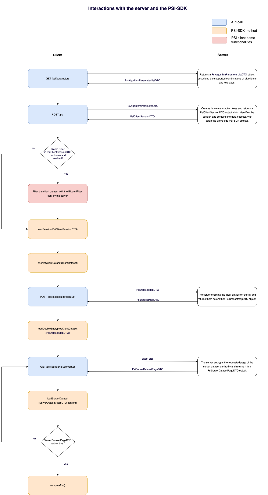

# PSI Client Demo

Command line Java program that relies on the [PSI-SDK library](https://github.com/alessandropellegrini/psi-sdk)
to implement the client in a Private Set Intersection (PSI) computation.

The goal of this repo, in conjunction with the [Psi Server Demo repository](https://github.com/alessandropellegrini/psi-demo-server),
is to provide a demo of how a client and a server could use the PSI-SDK library
to implement an end-to-end PSI calculation. Given its instructional scope,
this code is not designed to be used in production environments, if not as a 
starting point for more complete implementations.

This demo supports all the PSI algorithms (and key sizes) supported by the PSI-SDK library, namely,
Blind-Signature PSI, Diffie-Hellman PSI, Blind-Signature PSI based on elliptic curves and Diffie-Hellman PSI based
on elliptic curves. Their comparison is outside the scope of this demo.

## Building and running the CLI
The build process is based on Maven. As anticipated, this program depends on the 
PSI-SDK library. If it is not available in a remote Maven server, the jar of the library can 
be generated locally by running the following command from the PSI-SDK root folder:

    mvn clean install

Once the PSI-SDK jar is available in either a remote or local Maven repository, build an executable jar 
by running the following command from the root folder of this repo:
    
    mvn clean compile assembly:single

To run the executable jar, which by default is generated in the target folder, run
the following command from the root folder of this repo

    java -jar target/psi-demo-client-1.0-jar-with-dependencies.jar [arguments]

## Redis Cache Provider
Caching the result of previous encryption operations can result in a significant
performance speed-up for PSI calculations that use the same keys.
The PSI-SDK library offers a simple key-store interface that allows the 
users of the library to select their preferred caching system. In this demo, we provide
an in-memory cache provider based on [Redis](https://github.com/redis/redis). 

The user can easily create a local Redis server with Docker for testing purposes with the following command:

    docker run --name redis -p 6379:6379 -d redis

For the BS and ECBS PSI algorithms, it is sufficient that the server sends 
the same public key in subsequent executions to effectively exploit the cache and get cache hits.
Conversely, as the DH and ECDH algorithms require the client to generate its own private key, passing
the same key used by previous executions as parameter is required to get cache hits, and thus, 
execution speed-ups through caching.

## Bloom Filter implementation

A Bloom filter is a probabilistic data structure that is used to test whether an element is a member of a set. 
Remarkable properties of this data structure are its high space efficiency, low computing cost and that, despite showing
false positives, it does not provide false negatives.

Despite being outside the scope of the PSI-SDK, this demo also includes a
Bloom Filter implementation (also implemented in the server repo) based on the 
[Google Guava library](https://github.com/google/guava) to show how this data 
structure could be used to further reduce the execution time of the PSI computation.

The Bloom Filter of the server dataset is provided by the server and is queried by the client to filter out its own dataset before
running the more computationally expensive operations associated to the PSI calculation. The server implemented 
in the Psi Server Demo repository updates the Bloom Filter of its dataset asynchronously every few minutes. 
Given this approach, we provide to the CLI user a parameter to define the max time in minutes since 
the Bloom Filter creation such that it is considered. This allows the users to select the window of validity of the Bloom
Filter based on the frequency of writes in the server dataset. Using a stale Bloom Filter of the server dataset (i.e., a Bloom Filter that does not reflect the 
updated state of the dataset) for filtering the client dataset could lead to excluding from the result of the PSI 
some items which were added to the server dataset after the Bloom Filter creation.

## Server communication
Following the traditional client-server scheme, the client sends to the server 
a request to start a new PSI session, which is represented by a session identifier, a PSI algorithm, a key size and set of keys 
(whose structure may depend on the specific PSI algorithm). Moreover, the client 
has the responsibility of calling the server APIs in the correct order to 
complete the end-to-end PSI calculation.

This client expects that the server offers the following APIs 
(their server-side implementation is available in the PSI server demo repo):
 - **GET psi/parameters**: gets a list of pairs of PSI algorithms and key sizes supported by the server.
 - **POST /psi**: creates a new PSI session for the algorithm and key size passed in the body. Returns the session identifier and all the fields required to initialize the PSI-SDK client components.
 - **POST /psi/{sessionId}/clientSet**: sends to the server a client-side encryption of the client dataset.
 - **GET /psi/{sessionId}/serverSet**: gets a server-side encrypted page of the server dataset.
 
We note that, in the context of this demo, the client does not require kind of authorization to access these APIs. 
In actual implementations, some form of authentication should be introduced to only allow
authorized users to create new sessions. 
Moreover, the APIs that refer to a specific session should only be accessible by the client that requested 
its creation (e.g., by making the server generate and send to the client a session-specific key 
whenever a new session is created).

## Interaction with the PSI-SDK library
To summarise how the client mixes API calls to the different methods offered by the PSI-SDK library, 
we provide the following diagram:

As shown by the diagram, in this demo we consider a bulk encryption of the whole
client dataset. Moreover, we also send the entire (encrypted) client
dataset in a single page to the server, which results in a bulk encryption of the client dataset
at the server side. This approach is reasonable whenever the client dataset 
is relatively small in comparison to the server dataset.

However, the PSI-SDK also supports a pagination-style 
approach as the client can simply call the encryptClientDataset() method multiple times
(even concurrently) for different portions of the client dataset. 
Similarly, the client dataset can be sent in different pages by calling 
the API **POST /psi/{sessionId/clientSet** multiple times (either subsequently or concurrently).

We note that the PSI-SDK natively supports parallelism and can be configured 
to run encryption operations with the desired number of threads directly at the
library level. Exploiting this feature, the code of this demo delegates 
the library to manage parallelism. However, the PSI-SDK is also thread-safe and
supports multiple calls to any of its method. This could allow the client
to run in parallel on different threads the encryption/sending of its own dataset and 
the download of the server dataset.

## Commands and parameters
This CLI supports two different commands:
- **list**: get the list of algorithms and key sizes supported by the server for PSI calculations. The user should pass the URL of the server as a mandatory parameter.
- **compute**: run the PSI calculation with the input parameters. The user should pass the URL of the server and a file containing the client dataset as mandatory parameters.

The list of supported parameters is the following:

| Full | Shortened | Description | Required | Default |
|---|---|---|---|---|
| --serverUrl | -url | URL of the server exposing the PSI server API | Yes |    -  |
| --inputDataset | -i | File containing the client dataset. Each line of the file is interpreted as an entry of the dataset | Only for compute |    - |
| --output | -o | Output file containing the result of the PSI | No | out.txt |
| --algorithm | -a | Algorithm used for the PSI computation. Should be compliant with the values provided by the list command | No | BS |
| --keysize | -k | Size of the keys used for the PSI computation. Should be compliant with the values provided by the list command | No | 2048 |
| --keyDescriptionFile | -key | Yaml file containing the key description for the specific algorithm | No |    - |
| --outputKeyDescriptionFile | -outkey | Output file on which the key description used by the algorithm is printed at the end of the execution | No | key.yaml |
| --cache | -c | Defines whether the client-side PSI calculation should use the Redis cache | No | false |
| --cacheUrl | -curl | Defines the url of the Redis cache | No | localhost |
| --cachePort | -cport | Defines the port of the Redis cache | No | 6379 |
| --bloomFilterMaxAge | -bf | If set, defines the max minutes since the Bloom Filter creation to consider it valid. If the server sends an older Bloom Filter, the Bloom Filter is not applied. If this parameter is not set, the Bloom Filter is not applied, even if sent by the server| No |    - |
